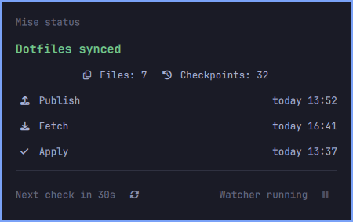
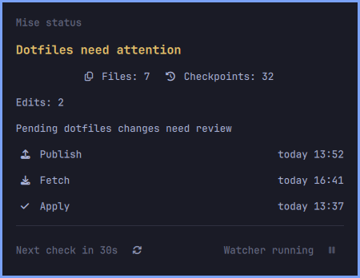
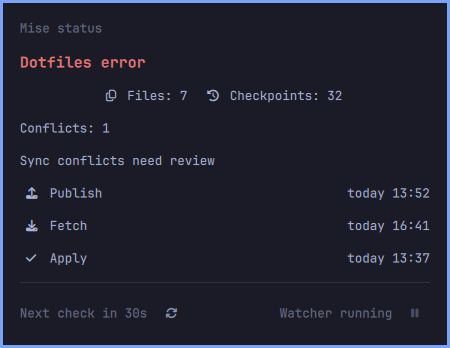
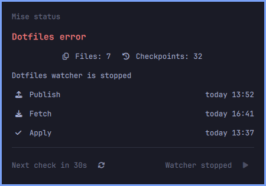

# oma-mise — Mise status for Omarchy

A small mise logo tinted red/yellow/green in the Omarchy 4 bar. Click it for mise's
local dotfile synchronization status. Inspired by
[jankeesvw/omarchy-time-machine](https://github.com/jankeesvw/omarchy-time-machine),
using Omarchy's native panel components rather than a separate tray daemon.

## Meaning

- **Green:** tracked files are healthy, the history watcher is running, no
  pending changes or reported failures, and the last fetch is recent.
- **Yellow:** changes are pending, synchronization is degraded or unconfirmed,
  setup is incomplete, or status cannot be read. A fetch older than 15 minutes
  is unconfirmed, not evidence that the watcher has stopped.
- **Red:** conflicts, reported sync failures, unavailable history, or a stopped
  watcher require attention. Failures take precedence over pending changes.

The popup has a muted title, a status-colored summary, watcher start/stop controls,
file/checkpoint icons on their own centered row, and publish/fetch/apply rows
with right-aligned timestamps.
Below a divider, a live `Next check in 30s` countdown leads to the next status poll;
longer durations use hours/minutes/seconds. The next poll is scheduled 30 seconds
after a check completes. Opening the popup or clicking its refresh icon checks
immediately and resets the countdown. Right-clicking the bar logo also refreshes.
Escape still closes the popup, without a keyboard hint. Polling is shared across
monitors by a QML singleton and continues while the watcher is stopped.
The official logo is bundled locally as tinted SVGs; no runtime download is needed.
See `assets/README.md` for its source. Dates use local `today HH:mm`,
`yesterday HH:mm`, or `4 sep HH:mm` formatting.
Hovering Publish, Fetch, or Apply dates shows only the largest whole elapsed unit:
`3d ago`, `2h ago`, `8m ago`, or `12s ago`. Tooltips update while hovered;
the countdown format is unchanged.

Status checks are read-only: they run `mise bootstrap dotfiles status --json`
from your home directory and read the user service state. Mise itself may render
trusted templates when checking status. No dotfile contents, credentials, or raw
CLI errors are shown. The plugin reports local observations, not an independent
remote check.

The watcher button is an explicit write action: it starts/stops only the existing
systemd user unit `dev.mise.mise-history.service`, verifying its state afterwards.
Stopping pauses automatic saves and synchronization; starting resumes the existing
mise workflow and may publish or apply pending changes. These actions do not alter
service enablement/autostart or mise configuration. Unknown/missing/transitional
service states disable the button; failures are displayed. Each systemctl command
has a 15-second timeout. No root access is used.

## Screenshots and publishing

Actual native popup screenshots with staged demo data—not real sync incidents.

### Green — synced



### Yellow — pending changes



### Red — sync conflict



### Paused watcher



Pausing stops the watcher service; the current health policy marks a stopped
watcher red. This screenshot is a demo, not a change to the live watcher.

See [popup screenshots](screenshots/README.md) for staged green/yellow/red examples
and [the publishing checklist](docs/PUBLISHING.md) for private testing, public
distribution and release preparation. The repository is currently private.

## License

The plugin code is licensed under the [MIT License](LICENSE). The bundled mise
logo retains its upstream ownership; see [asset attribution](assets/README.md).

## Requirements

- Omarchy 4 with its Quickshell plugin system
- Python 3 (standard library only)
- Mise with `bootstrap dotfiles status --json` (tested with 2026.9.3)
- A configured mise dotfiles/history setup

The helper prefers `~/.local/bin/mise`, falling back to `mise` on the shell's PATH.

## Local installation

Keep this folder somewhere permanent, then link it into the user plugin directory:

```sh
mkdir -p ~/.config/omarchy/plugins
ln -s /absolute/path/to/oma-mise ~/.config/omarchy/plugins/local.mise-status
omarchy plugin validate ~/.config/omarchy/plugins/local.mise-status
omarchy-shell shell rescanPlugins
```

Discovery is asynchronous. Once `omarchy plugin list` shows `local.mise-status`:

```sh
omarchy plugin enable local.mise-status
omarchy bar move local.mise-status --section right --after omarchy.tray
```

No root access or additional service is needed. Local plugin changes normally
hot-reload; if QML stays cached after rescanning, use `omarchy restart shell`.
The initial installation on this machine links to
`/home/filip/c/oma-mise` and is enabled next to the system tray.
The source folder is named `oma-mise`; the stable plugin ID remains
`local.mise-status` so existing bar configuration and IPC commands keep working.

To hide it: `omarchy plugin disable local.mise-status`.
To uninstall, disable it first, then remove only the plugin symlink.

## Verification

```sh
python3 -m unittest discover -s tests -v
QT_QPA_PLATFORM=offscreen QT_FORCE_STDERR_LOGGING=1 \
  /usr/lib/qt6/bin/qmltestrunner -input tests -o -,txt
omarchy plugin validate .
python3 status.py
```

Use the **Qt 6** test runner on Arch; `/usr/bin/qmltestrunner` can be Qt 5.
`Presentation.js` is QML JavaScript (`.pragma library`), not a Node module.

For a live popup check: `omarchy-shell local.mise-status open`.
For shell diagnostics: `quickshell log -p /usr/share/omarchy/shell -t 30`.

Source is deliberately separate from `dotfiles-private`: editing this plugin
must not enroll it in mise's automatic commit/publish stream.
