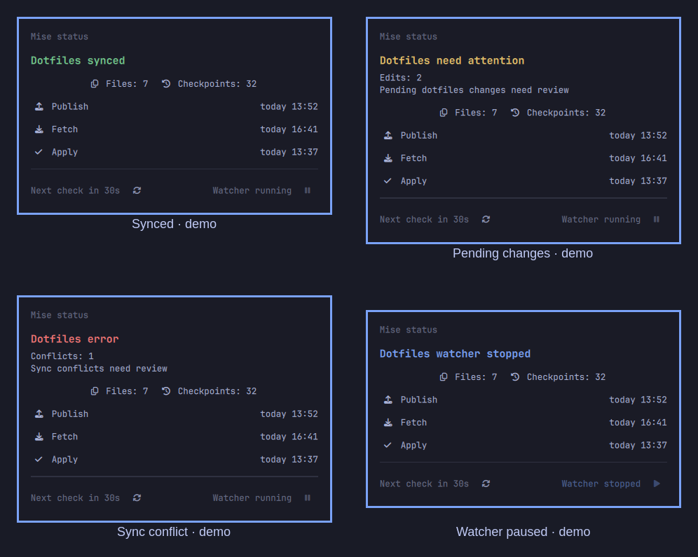

# Popup screenshots

Actual screenshots of the native Omarchy popup, using **staged demo status data**.
They are not evidence of real pending edits or conflicts on the author's machine.

| Image | State |
|---|---|
| [green-synced.png](green-synced.png) | Green: dotfiles synced |
| [yellow-pending.png](yellow-pending.png) | Yellow: two pending edits |
| [red-conflict.png](red-conflict.png) | Red: one sync conflict |
| [paused-watcher.png](paused-watcher.png) | Blue watcher paused/stopped, with muted-blue footer and resume icon |
| [paused-tray-icon.png](paused-tray-icon.png) | Native blue mise bar icon crop |
| [states-overview.png](states-overview.png) | Four-state social image, labelled as demo states |

Captured on 8 September 2026, using the user's existing popup width and desktop
theme. Files and checkpoints have their own centered row; the yellow summary
now fits without elision. No UI text was composited over the individual screenshots.
Reasons sit directly below the summary, before the counts. The stopped state is
blue; real sync errors would still take priority as red.
The overview only adds spacing and demo labels around the original crops.

## Capture safety

A temporary copy of the plugin used deterministic display-only status helpers.
The demo watcher helper never invoked systemctl and disabled its action button.
The installed plugin symlink was temporarily switched to this copy, the shell
restarted, each native popup captured with grim, and the symlink restored in a
`finally` block. The actual mise watcher was not stopped or changed. After capture,
the original plugin path and active watcher service were verified.

Images are tightly cropped to the popup: no other windows, desktop text, file
paths, repository URLs or credentials are included. Files/checkpoint counts and
timestamps are demo values. Original screenshots were cropped with ImageMagick;
the overview was assembled with `magick montage`.

Use the individual PNGs as attachments or use `states-overview.png` for one post.
Refer to the yellow/red states as demonstrations rather than actual incidents.
The repo is still private: download/attach the files rather than sharing private
raw-image links. Nothing has been posted to X.
